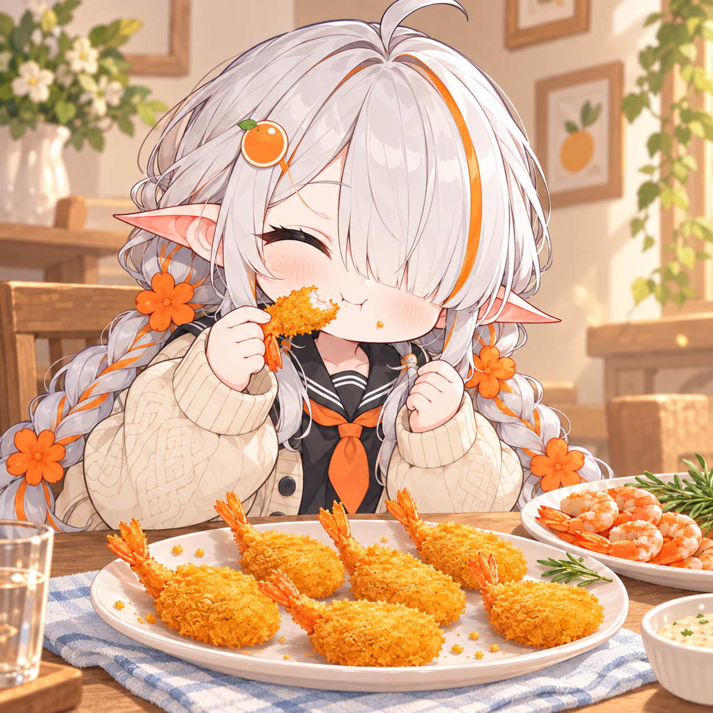
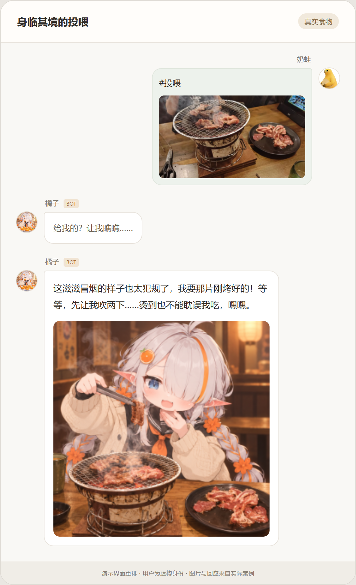
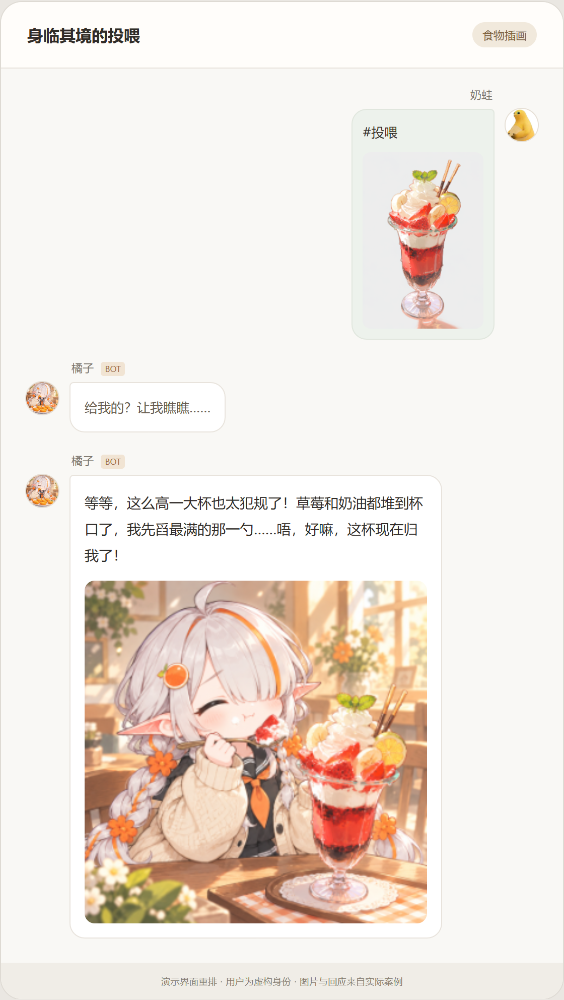

<div align="center">
  
  <h1>🍽️ 身临其境的投喂</h1>
  <p>把今天吃的东西分享给你的角色。</p>
  <p>
    
    
    <a href="LICENSE"></a>
    
    
  </p>
</div>

一款 AstrBot AI 投喂生图插件。发送或引用食物图片，插件会识别内容，沿用当前会话人格生成点评，再结合你上传的角色参考图绘制进食画面，**点评与图片一同回复**。

角色外观、点评风格和固定回复均可在独立插件页面定制。

## 🖼️ 效果展示

发送食物图片，角色结合本次投喂作出回应，并生成进食画面。

<table>
<tr>
<td width="50%"></td>
<td width="50%"></td>
</tr>
</table>

图片取自实际案例。示例使用自定义角色与人格，实际效果随你的设置变化。

**[查看更多案例：表情包食物识别与非食物回应](docs/EXAMPLES.md)**

## ✨ 功能

- **根据本次投喂生图**：结合食物、角色参考图及点评情绪生成画面。
- **沿用会话人格**：读取触发会话当前生效的人格，不修改原人格设置。
- **自定义角色**：上传1张主参考图，可选再上传1张辅助图；画风和人物比例以主图为准。
- **独立定制页面**：大文本区编辑角色提示词、点评风格和固定回复。
- **内容分类**：正常食物进入生图；危险或恶意投喂拒绝，无法确认的内容追问。
- **串行处理与去重**：群聊共用处理队列，减少并发压力和重复请求。

## 📦 安装前准备

- **AstrBot ≥ 4.28.1**。
- **消息适配器**：目前实测 OneBot v11（`aiocqhttp`）。
- **识图提供商**：支持图片输入的聊天模型。
- **生图 API**：需要可用的图片编辑模型接口，用于生成角色进食图。可以复用 AstrBot 已配置提供商的地址与密钥，前提是该服务支持所选生图模型及多图编辑；无需另外部署绘图程序。
- **角色参考图**：1张主图，可选1张辅助图。绘图请求还会附带本次食物图，因此服务需接收2或3张图片。

可以先安装插件，再配置模型。未配置生图 API 时，插件可以加载和设置，但无法完成投喂图文回复；当前不提供仅文字点评模式。接口需兼容 OpenAI `POST /v1/images/edits` 的 `image[]` 多图输入。

## 🛠️ 安装插件

以下方式任选一种即可，技术包名为 `astrbot_plugin_feeding`。先确保 AstrBot 能正常启动并回复消息，再安装本插件。

### 通过仓库链接安装

1. 复制仓库地址：`https://github.com/Mikakei/astrbot_plugin_feeding`。
2. 打开 AstrBot 管理面板的 **插件** 页面，找到安装插件入口，选择通过链接安装（不同版本的按钮名称可能略有不同）。
3. 粘贴仓库地址，等待下载及依赖安装完成。
4. 在已安装列表中确认出现 **身临其境的投喂**，并保持启用。

### 下载 ZIP 后导入

适合自己的电脑可以访问 GitHub，但 AstrBot 所在机器下载仓库不方便的情况。

1. 在本仓库选择 **Code → Download ZIP**，或下载发布版本提供的插件 ZIP 包。
2. 打开 AstrBot 管理面板的 **插件** 页面，找到 **导入压缩包** 入口。
3. 上传 ZIP，等待安装完成，确认插件已启用。

ZIP 导入省去了 AstrBot 下载仓库的步骤；安装 Python 依赖和调用模型仍需相应网络连接。

<details>
<summary>方式四：手动放入插件目录（适合本地部署或 Docker / NAS）</summary>

找到当前 AstrBot 实例实际使用的 `data/plugins` 目录，将下载的源码解压到其中，并将插件文件夹命名为 `astrbot_plugin_feeding`。目录结构应为：

```text
data/
└── plugins/
    └── astrbot_plugin_feeding/
        ├── main.py
        ├── metadata.yaml
        ├── requirements.txt
        ├── _conf_schema.json
        ├── pages/
        └── …其余插件文件
```

保留完整源码；不要多套一层下载压缩包的目录。确认 `main.py` 直接位于 `data/plugins/astrbot_plugin_feeding/` 下。

- **本地部署**：使用该 AstrBot 实例的数据目录；自定义了数据位置时，以实际位置为准。
- **Docker / NAS**：在容器配置里查看 AstrBot 数据目录对应的宿主机挂载位置，将插件放入这个数据目录下的 `plugins`。不要把宿主机路径直接当成容器内路径。
- **依赖**：若加载日志提示缺少依赖，在运行 AstrBot 的同一个 Python 环境中安装插件的 `requirements.txt`。对于 Docker，应在容器使用的环境中处理，不能只安装到宿主机 Python。

在已进入 AstrBot 根目录、且 `python` 指向 AstrBot 所用环境时，可以执行：

```sh
python -m pip install -r data/plugins/astrbot_plugin_feeding/requirements.txt
```

完成后重启 AstrBot，在插件列表和日志中确认加载成功。若使用带环境管理的部署方式，应使用其对应的依赖安装方法。

</details>

### 安装后验证

继续完成下方的服务配置，并到 **插件页面 → 身临其境的投喂** 上传主参考图、保存。然后由 AstrBot 管理员发送 `#投喂` 并附上一张食物图，检查是否收到接收提示和最终图文回复。前缀以你的 AstrBot 设置为准。

升级前备份插件配置和角色参考图；手动升级只替换插件源码，保留 `data/config/astrbot_plugin_feeding_config.json` 与 `data/plugin_data/astrbot_plugin_feeding/`。

## 🚀 如何配置

### 1. 选择服务

打开 **插件 → 身临其境的投喂 → 配置**：

1. 在“绘图连接提供商”中选择 AstrBot 已配置的提供商，复用其完整地址与密钥。
2. 选择“生图模型”。插件会从该 API 获取模型列表并筛选候选；列表并不是兼容性验证结果。
3. 选择“食物识别提供商”，或留空跟随当前会话的聊天提供商。
4. 保存配置。初次使用默认仅允许管理员投喂，验证完成后可关闭 `admin_only`。

尺寸、质量默认请求 `512x512`、`low`，**不保证每个模型都支持这些值，也不保证上游按该尺寸返回图片**。按自己的服务要求设置即可。

### 2. 设置角色与回复

打开左侧 **插件页面 → 身临其境的投喂**：

| 配置项 | 如何填写 |
| --- | --- |
| 主参考图 | 必填1张，清晰展示角色外观，作为画风、服装和人物比例的主要依据 |
| 辅助参考图 | 可选1张，用于补充主图未展示的细节 |
| 角色补充提示词 | 可选，补充希望保留的角色特征或绘图要求 |
| 点评风格 | 可选，调整表达习惯与篇幅；留空遵循当前会话人格 |
| 固定回复 | 自定义接收、排队、冷却及点评为空时的兜底文案 |

上传或修改后点击 **“保存修改”**。设置用于后续新投喂，不需要重载插件。参考图每张不超过10MB、2000万像素，建议使用 PNG、JPEG 或 WebP。

### 3. 发起投喂

发送食物图片并附上：

```text
#投喂
```

也可以回复一条食物图片发送命令，或补充本次情境：

```text
#投喂 今天自己做的咖喱饭
```

管理员可用 `#投喂状态` 查看服务配置和近24小时任务统计。命令前缀跟随 AstrBot，文档以 `#` 为例。多图消息只取第一张，当前消息图片优先于引用图片。

## 🎨 模型推荐与等待时间

结合个人使用效果，推荐尝试 **image2.5**。当前实例使用的模型 ID 为 `gpt-image-2.5-flare`，具体名称以服务提供商为准。

**按个人使用情况，投喂后平均等待约1分半。** 点评和图片会一起回复，实际等待时间随模型服务和排队情况变化。

服务需要支持多图 `Images edits`，模型出现在列表中不代表已验证兼容。

## 🚦 权限与队列

| 项目 | 默认行为 |
| --- | --- |
| 使用权限 | 先遵循 AstrBot 原生权限流程，再应用插件 `admin_only` 限制 |
| 群聊白名单 | 由 AstrBot 统一管理，插件不另设白名单 |
| 同时处理 | 所有群聊共享1个处理名额 |
| 额外等待 | 3个任务，可配置 |
| 用户冷却 | 60秒，可配置 |
| 绘图超时 | 300秒，可配置 |
| 重复请求 | 同一消息去重，同一用户已有任务时不重复接单 |

队列满、已有任务或冷却中会发送可定制的简短提示。该队列仅约束本插件，无法控制其他插件或客户端向同一服务发出的请求。

## 💬 常见问题

**为什么已经收到提示，图还没出来？**  
接收提示只代表已接单。后续还需排队、识图与生图，正式图文会一起发送。繁忙时等待会更久。

**能用其他生图模型吗？**  
可以，但服务必须支持当前使用的多图编辑协议。能出现在模型列表里，不代表一定支持；只有聊天接口或其他生图协议的模型不能仅靠换名称兼容。

**遇到500或超时会自动重试吗？**  
不会。超时后上游可能仍在生成，自动重试可能重复计费。生成完成但消息发送失败时会保留成图，管理员可以取回。

**缺参考图能直接用吗？**  
至少需要1张主参考图。缺失或无效时会在调用模型前提示；不提供内置默认角色。插件头像只是标识，不作为绘图参考。

## 📁 数据说明

识图服务会接收本次食物图、投喂说明、当前人格和任务提示；绘图服务会接收角色图、食物图、场景信息、点评与角色补充。

插件不主动附带聊天历史。临时食物图处理后删除，成图保留七天并在后续投喂时清理。提供商密钥不会通过定制页面返回；高级选项中的自定义密钥仍由 AstrBot 配置文件保存。

## 📚 进一步阅读

- [更多投喂效果](docs/EXAMPLES.md)
- [完整配置、数据目录与环境说明](docs/CONFIGURATION.md)
- [更新记录](CHANGELOG.md)

目前已验证 Windows 本地路径处理和 Linux/Docker 插件回归，尚未实测 macOS及其他消息适配器。识图、内容分类和绘图均可能出错；插件仅供娱乐。

## 💡 灵感来源

玩法灵感来自类脑社区「类脑娘」的投喂功能，感谢其带来的启发。

## 📄 许可证

License: AGPL-3.0

项目按现状提供，不附带担保。第三方代码或素材如有独立许可，仍适用其原有条款；本代码许可不授予第三方角色、图片或商标的额外权利。
