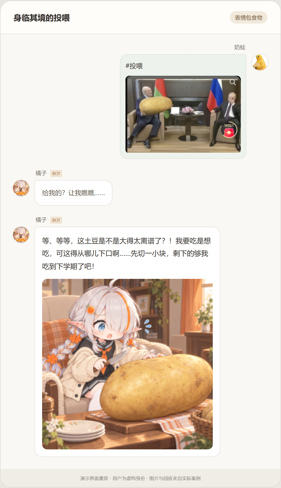
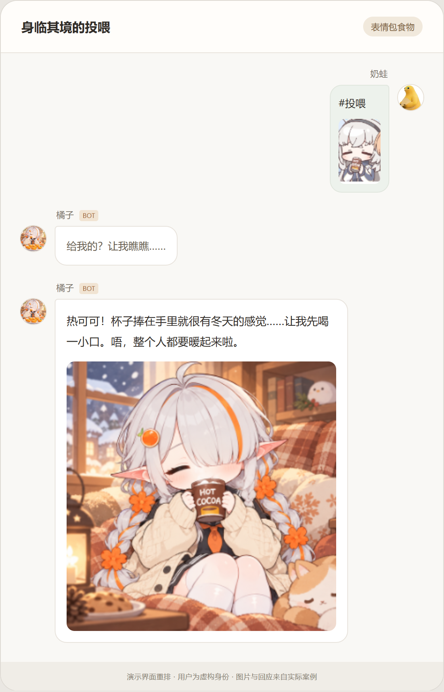
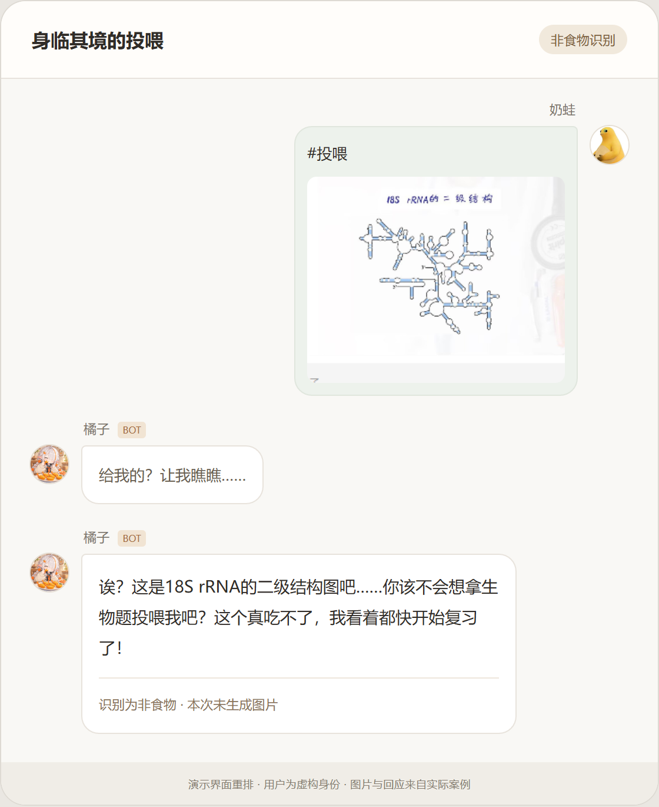
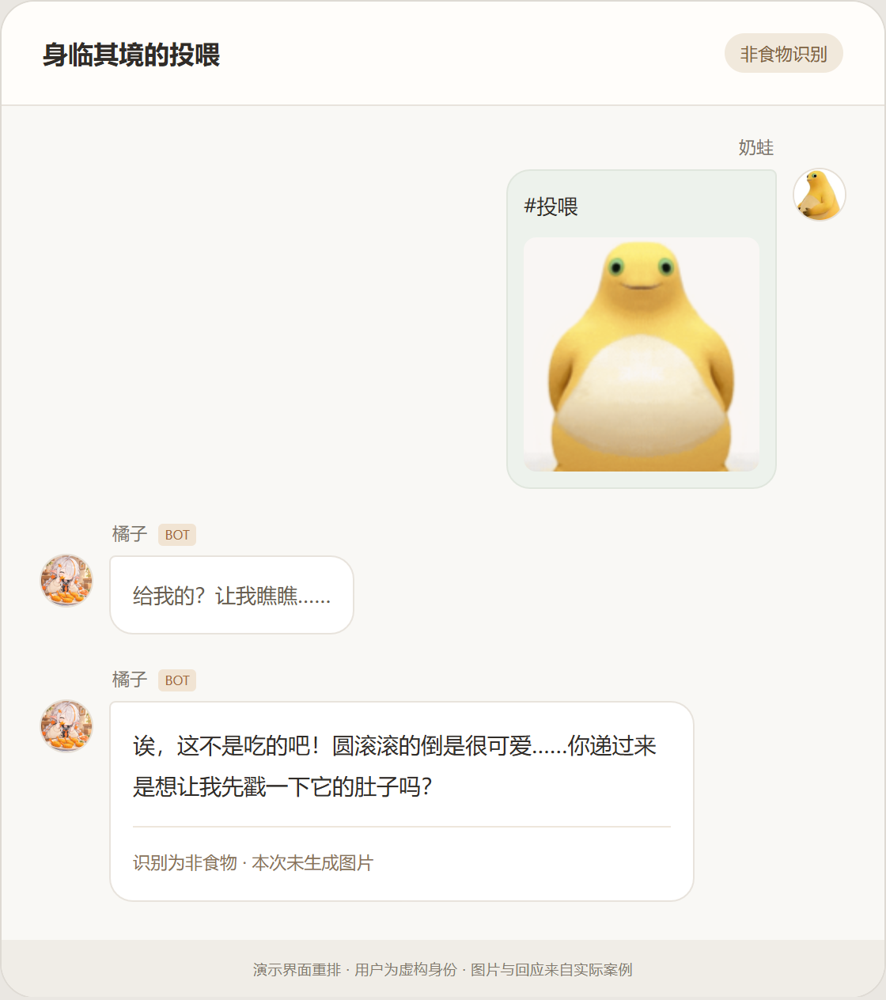

# 投喂效果展示

[返回首页](../README.md)

以下使用虚拟聊天界面重新展示实际案例。

页面中的案例标题、分类与非食物结果说明为展示标注，并非机器人原消息。示例使用自定义角色与人格，其他实例的外观及表达随各自设置变化。

[下载或本地打开完整聊天演示页面](images/chat-demo.html)

## 正常投喂

发送食物照片或插画，获得结合本次食物的点评与进食图片。

<table>
<tr>
<td width="50%"></td>
<td width="50%"></td>
</tr>
</table>

## 从表情包中识别食物

这两次投喂分别从表情包中识别出了土豆和热可可，并生成对应回应。图片过小、遮挡或含义模糊时，识别结果可能不同。

<table>
<tr>
<td width="50%"></td>
<td width="50%"></td>
</tr>
</table>

## 非食物回应

这两次输入被识别为非食物，插件给出人格化文字回应，没有继续生图。这些案例展示具体识别结果，不代表所有非食物都能准确识别。

<table>
<tr>
<td width="50%"></td>
<td width="50%"></td>
</tr>
</table>
